<p align="center">
  
</p>

<p align="center">
  
</p>

<p align="center">
  
  
  
  
  
  
  
</p>

<p align="center">
  
</p>

<p align="center">
  <a href="#-the-problem">Problem</a> ·
  <a href="#-the-solution">Solution</a> ·
  <a href="#-live-dashboard-tour">Dashboard</a> ·
  <a href="#-sensor-fusion-in-action">Sensors</a> ·
  <a href="#-digital-track-health-map">Health Map</a> ·
  <a href="#-hardware--architecture">Architecture</a> ·
  <a href="#-impact">Impact</a> ·
  <a href="#-getting-started">Get Started</a>
</p>

<p align="center"></p>

<p align="center">
  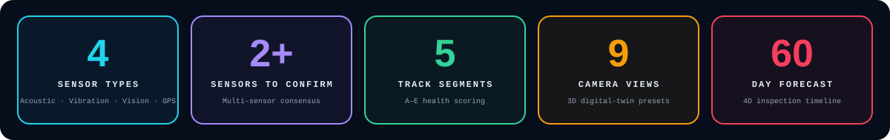
</p>

## ⚡ TL;DR

> **AAHAT** (*Aahat* = "the sound of a knock / footstep") is an **AI-powered, multi-sensor railway safety system** that *listens* to the track. It fuses **acoustic, vibration, vision and GPS** data, detects anomalies early, **pins their exact position on a digital twin**, scores their severity, and **forecasts when they become critical** — turning silent track deterioration into early, actionable maintenance alerts.

<p align="center">
  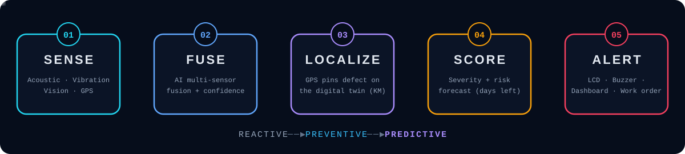
</p>

<p align="center"></p>

## 🚨 The Problem

Rail defects — cracks, spalls, gauge widening, geometry deviations — grow **silently**. Today's inspection options each leave a gap:

| Approach | Strength | Limitation |
|---|---|---|
| **Ultrasonic flaw detection** (ENSCO URFS, Wabtec FLEX, Herzog, Plasser) | Very accurate for internal cracks | Expensive, needs trained operators, inspects only **every few days / weeks** |
| **GPR + InSAR monitoring** | Network-scale view of ballast / subgrade | Not real-time, **not for surface / crack detection** |
| **AAHAT (this project)** | Low-cost, continuous, **multi-sensor verified**, predictive | Needs validation on real track data (planned Phase 2/3) |

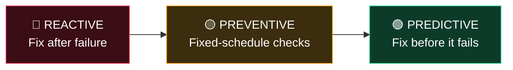

**AAHAT moves railway maintenance from Reactive → Preventive → Predictive.**

<p align="center"></p>

## 🧠 The Solution

AAHAT mounts on an inspection vehicle / trolley and runs a continuous loop:

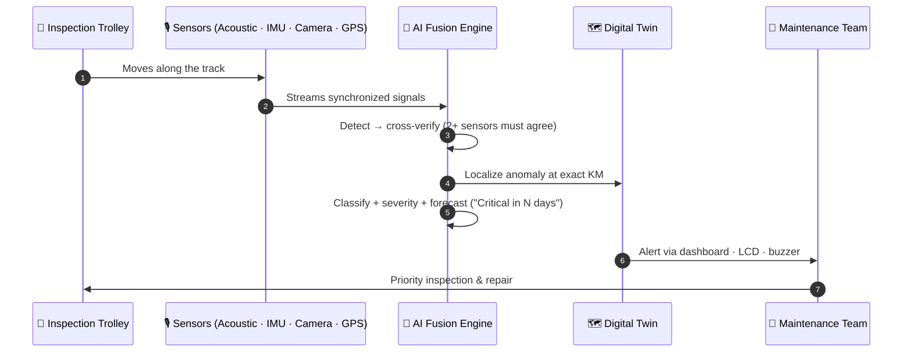

### ✨ Key Features

| | Feature | What it does |
|---|---|---|
| 🎧 | **Acoustic monitoring** | FFT spectrogram spots anomalous noise bursts from wheel–rail interaction |
| 📳 | **Vibration analysis** | 3-axis MEMS accelerometer waveform flags spikes in G-force |
| 👁️ | **Vision AI** | YOLO-v9 optical feed detects visual defects (e.g. gauge widening deviation) with a confidence score |
| 📐 | **Laser crown profile** | Measures rail-head crown deviation in mm against the ideal profile |
| 🛰️ | **GPS localization** | Pins every defect to an exact track position (e.g. `KM 124.7`) |
| 🤝 | **Multi-sensor consensus** | A defect is *confirmed* only when 2+ sensors agree → far fewer false alarms |
| 🔮 | **Predictive forecasting** | "Ghost ring" shows a defect's forecast; e.g. *"Critical in 5 days"* |
| 🗺️ | **Digital track health map** | Segment-wise health, overall route health index, 4D inspection timeline |
| 💬 | **Natural-language AI explanations** | Each detection in the feed can be explained in plain English |
| 🔔 | **Instant alerts** | LCD + buzzer + dashboard: *"Priority inspection recommended"* |

<p align="center"></p>

## 🎬 Live Dashboard Tour

The **AAHAT Live Track Monitoring** dashboard is an interactive 3D digital-twin simulator. Nine camera presets, a 4D inspection timeline (Day 1 → Day 60) and a Forecast Mode let you watch a trolley scan the route while the AI detects, localizes and predicts defects.

> 📸 *Screenshots below are captured from the running prototype.*

### 🚂 Multi-angle 3D view — Side Elevation with a confirmed defect

<p align="center">
  
</p>

The **multi-sensor halo** (red pulse) marks `DEF-102` as **HIGH** risk, **confirmed 3/3** by acoustic, vibration and vision, with a forecast of **"Critical in 5 days"**.

### 🎥 Rear high-iso and head-on views

<table>
  <tr>
    <td width="50%" align="center">
      <br>
      <sub><b>Rear High-Iso</b> — <code>DEF-104</code> MEDIUM, confirmed 2/3, forecast critical in 23 days, with the predictive <i>ghost ring</i></sub>
    </td>
    <td width="50%" align="center">
      <br>
      <sub><b>Direct Front (Head-on)</b> — the trolley advances along the track past KM markers while live streams update</sub>
    </td>
  </tr>
</table>

### 🎛️ Control panels

<table>
  <tr>
    <td width="33%" align="center">
      <br>
      <sub><b>9 camera presets</b> + 4D Sensor Working View (Optical CV · Acoustic 4D · IMU Accel · LiDAR 4D)</sub>
    </td>
    <td width="33%" align="center">
      <br>
      <sub><b>Live telemetry</b> — position, trolley speed, vibration G, acoustic dB, gauge deviation, rail temperature</sub>
    </td>
    <td width="33%" align="center">
      <br>
      <sub><b>Risk categories</b> — Normal · Monitor · Warning · Critical, with halo and ghost-ring legend</sub>
    </td>
  </tr>
</table>

### 🗺️ GIS mini-map + AI detection feed

<p align="center">
  
</p>

The **2D top-down GIS mini-map** tracks the trolley's position (e.g. `334.0 m / 620 m`) and marks defects `DEF-104 … DEF-106`, while the **AI Detection Feed** lists every finding (e.g. `DEF-101 · Railhead Micro-Crack · KM 0.042`) with severity filters (**Critical / High / Medium / Low / Normal**) and *Natural AI Explanations*.

<p align="center"></p>

## 📡 Sensor Fusion in Action

Four synchronized live streams feed the AI engine. Watch the animation below: the vibration trace spikes, the FFT bursts, the vision model boxes a **gauge-widening deviation**, and the laser crown profile flattens by **+12 mm** — the moment multiple sensors *agree*.

<p align="center">
  
</p>

### Normal vs. anomaly — real dashboard captures

<table>
  <tr>
    <th align="center">✅ Healthy track</th>
    <th align="center">🚨 Anomaly detected</th>
  </tr>
  <tr>
    <td align="center"></td>
    <td align="center"></td>
  </tr>
  <tr>
    <td><sub>Vibration ≈ <b>0.23 G</b> · Acoustic ≈ <b>67 dB</b> · Crown deviation ≈ <b>−1.3 mm</b></sub></td>
    <td><sub>Vibration spike <b>0.95 G</b> · Acoustic burst <b>92.6 dB</b> · Crown <b>+12 mm</b> · Vision: <b>Gauge Widening Deviation, 94.8%</b></sub></td>
  </tr>
</table>

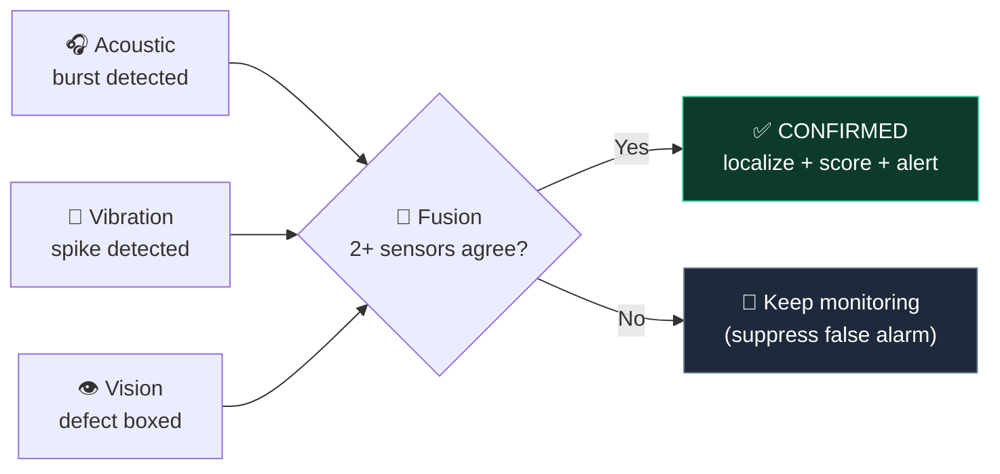

<p align="center"></p>

## 🗺️ Digital Track Health Map

The route is split into segments, each with its own health score, anomaly count and status. The animation shows the trolley sweeping the route, anomaly markers pulsing, and the **overall Route Health Index** filling to **66% → "Maintenance Recommended"**.

<p align="center">
  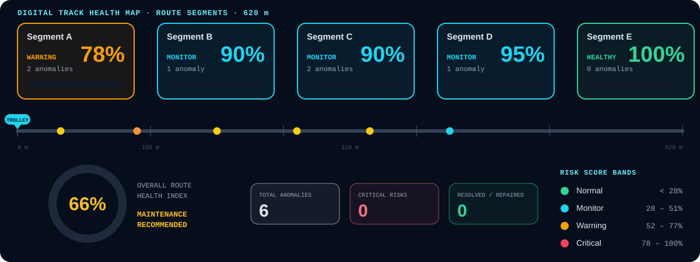
</p>

<p align="center">
  <br>
  <sub>Dashboard capture — segment health, 6 total anomalies, 0 critical risks, and the 4D inspection pass timeline (Day 1 · 15 · 30 · 45 · 60)</sub>
</p>

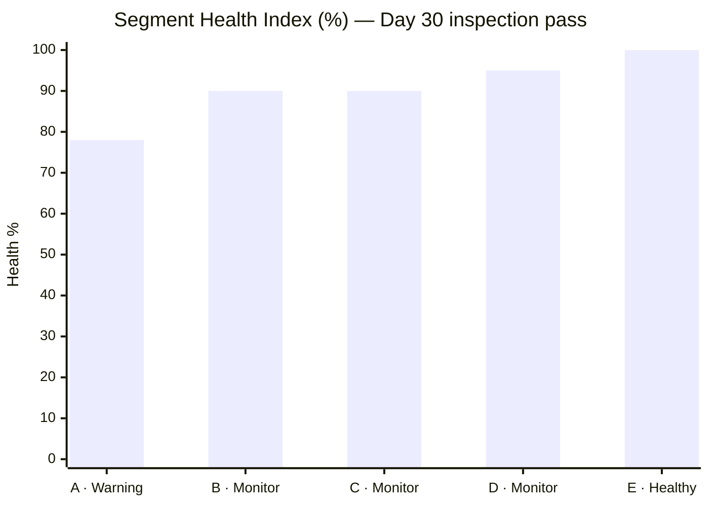

### 🎚️ Risk score bands

| | Category | Risk score | Meaning |
|---|---|---|---|
| 🟢 | **Normal** | < 28% | No action needed |
| 🔵 | **Monitor** | 28 – 51% | Watch the trend |
| 🟡 | **Warning** | 52 – 77% | Plan maintenance |
| 🔴 | **Critical** | 78 – 100% | Priority inspection |

<p align="center"></p>

## 🔧 Hardware & Architecture

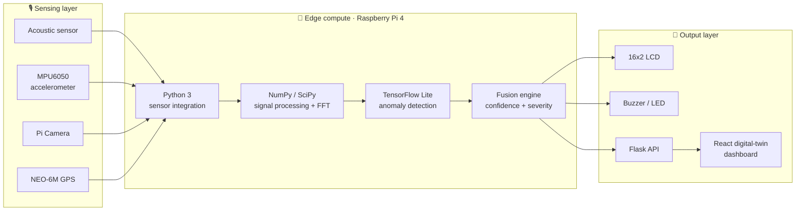

### 🧰 Tech stack

| Layer | Technology |
|---|---|
| **Hardware** | Raspberry Pi 4 · acoustic sensor · MPU6050 accelerometer · Pi Camera · NEO-6M GPS · 16x2 LCD · buzzer/LED · push buttons |
| **Edge software** | Python 3 · TensorFlow Lite · NumPy / SciPy |
| **Vision** | YOLO-v9 optical detection |
| **Backend / UI** | Flask + React dashboard (3D digital twin, GIS mini-map, live telemetry) |
| **Prototype rig** | Modular assembly on a mock track chassis with a motorized cart simulating the inspection vehicle |

### 🔄 Prototype user flow

```mermaid
stateDiagram-v2
    direction LR
    [*] --> Start: User clicks Start
    Start --> Scanning: Cart moves · sensors go live
    Scanning --> Healthy: 🟢 Green section
    Healthy --> Suspect: Near a defect · 🟡 yellow / orange
    Suspect --> Classified: AI classifies (e.g. Crack 87%)
    Classified --> Fused: Fusion → one confidence (e.g. 94%)
    Fused --> Localized: Pinned on twin (e.g. KM 124.7)
    Localized --> Critical: Severity assigned · 🔴 red if critical
    Critical --> Alert: LCD · buzzer · dashboard
    Alert --> [*]: "Priority inspection recommended"
```

<p align="center"></p>

## 🌍 Impact

| Who | How AAHAT helps |
|---|---|
| 👷 **Railway maintenance teams** | Faster, prioritized defect detection reduces manual inspection workload |
| 🧑‍🤝‍🧑 **Passengers** | Improved rail safety lowers derailment and accident risk |
| 🏛️ **Railway authorities** | Predictive insights cut long-term maintenance cost and downtime |
| 📈 **Economy** | Fewer disruptions and failures support reliable freight & passenger operations |

**Key benefits:** ⏱️ early detection · 🎯 higher accuracy through fusion · 📍 precise localization · 🔮 predictive maintenance · 💰 low-cost commodity hardware.

<p align="center"></p>

## ⚠️ Challenges & Mitigations

| Challenge | Mitigation |
|---|---|
| 🔊 **Sensor noise** masks real defect signatures | Advanced signal processing to isolate defect signatures from ambient noise |
| 🚫 **False alarms** from fusion errors | Multi-sensor cross-verification — a defect needs 2+ sensors to agree |
| 🧪 **Limited validation** — simulated data may not generalize | Phased validation: test on real track data in Phase 2/3 |
| 🌧️ **Hardware durability** — vibration & weather | Weatherproof, vibration-resistant enclosures |

> **Note:** the current prototype runs on **simulated data** for demonstration; real-track validation is part of the roadmap.

<p align="center"></p>

## 🛣️ Roadmap

- [x] Multi-sensor fusion concept & architecture
- [x] Interactive 3D digital-twin dashboard (camera presets, GIS mini-map, AI detection feed)
- [x] Live synchronized sensor streams (vibration · acoustic FFT · vision · laser crown)
- [x] Segment-wise track health map & 4D inspection timeline with Forecast Mode
- [ ] Calibrate on hardware rig with controlled track defects
- [ ] Validate models on real track data (Phase 2 / 3)
- [ ] Ruggedized, weatherproof enclosure for field trials
- [ ] Trend-based degradation models (e.g. Kalman-filter based) for longer-horizon forecasts

<p align="center"></p>

## 🚀 Getting Started

> ⚙️ *Adjust the commands below to match your repository's actual structure.*

```bash
# 1. Clone the repository
git clone https://github.com/<your-username>/<your-repo>.git
cd <your-repo>

# 2. Backend / edge (Python)
pip install -r requirements.txt
python app.py

# 3. Dashboard (React)
cd dashboard
npm install
npm run dev
```

### 📁 Repository structure

```text
Aahat/
├── README.md
├── hero-banner.svg
├── pipeline.svg
├── sensor-streams.svg
├── health-map.svg
├── divider.svg
├── stats.svg
└── Screenshot_2026-09-30_0232xx.png  (…10 dashboard screenshots)
```

<p align="center"></p>

## 📚 References

1. Liu et al., *"Acoustic emission detection of rail defect based on wavelet transform and Shannon entropy,"* Journal of Sound and Vibration, ScienceDirect.
2. Zhu et al., *"Evaluation of On-Vehicle Bone-Conduct Acoustic Emission Detection for Rail Defects,"* SCIRP, 2025.
3. *"A cost-effective real-time rail track monitoring system leveraging multi-sensor fusion,"* PMC/NIH.
4. *"Boosting Holistic Railway Infrastructure Monitoring and Health Prediction by Integrated Data Sets and Analysis,"* Springer.
5. *"Sensor Fusion for Track Geometry Monitoring: Integrating On-Board Condition Monitoring and Degradation Models via Kalman Filtering,"* arXiv, 2025.
6. *"Advancing railway track health monitoring: Integrating GPR, InSAR and machine learning,"* ScienceDirect, 2024.

<p align="center"></p>

## 👤 Author

**Chethan Kumar KP** · USN `1AT23CG034`
Atria Institute of Technology, Bengaluru

<p align="center">
  <br>
  
  <br><br>
  <sub>⭐ If you like AAHAT, consider starring the repo!</sub>
</p>

<p align="center">
  
</p>
